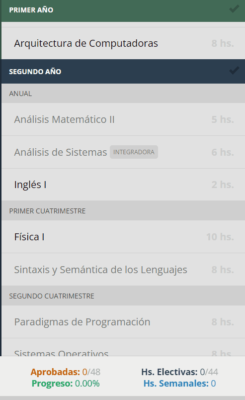

# ISI

El plan de estudios _interactivo_ de **Ingeniería en Sistemas de Información** de la [UTN FRCU](https://www.frcu.utn.edu.ar/).

[isi-frcu.vercel.app](https://isi-frcu.vercel.app/)

## 📜 Descripción



### Funcionalidades

- Marcar qué materias _aprobaste_, _regularizaste_ o estás _cursando_.
- Conocer qué necesitás regularizar o aprobar para cursar o aprobar una materia.
- Mantener marcadas las materias después de cerrar la pestaña o el navegador (utilizando [Local Storage](https://developer.mozilla.org/en-US/docs/Web/API/Window/localStorage)).
- Mostrar los siguientes datos:
  - Qué porcentaje de la carrera has completado
  - Cuántas materias has aprobado
  - Cuántas horas semanales estás cursando
  - Cuántas horas semanales de materias electivas aprobadas has acumulado

### Beneficios

- Saber qué materias podés cursar y cuáles no.
- Entender mejor tu situación académica.
- Priorizar qué materias son más importantes.
- Simular cómo será la cursada de próximos cuatrimestres.
- Saber cuánto te falta para egresarte.
- Compartir con tus compañeros, amigos y familiares tu situación académica.

## Preguntas frecuentes

### ¿Cómo se calcula el progreso?

El progreso, es decir, el porcentaje de la carrera que has completado, se calcula de la siguiente manera:

```
                Horas de materias              Horas de materias
              obligatorias aprobadas   +      electivas aprobadas
Progreso = ——————————————————————————————————————————————————————————— * 100
                Total de horas de      +   Total de horas requeridas
              materias obligatorias          de materias electivas
```

En el código, ese cálculo se encuentra en [estas líneas](https://github.com/valentincostam/isi/blob/master/src/js/main.js#L295-L301).

### ¿Se pueden agregar otras carreras a esta web app?

Sí, pero no sería fácil. Esta versión no cuenta con la posibilidad de cargar nuevas carreras, ni siquiera materias. Todos los datos de la carrera están [_hard-coded_](https://es.wikipedia.org/wiki/Hard_code).

Actualmente, estoy creando [Plande](https//plande.app), una web app similar a ésta, que permite cargar más carreras. Seguime en [Twitter](https://twitter.com/valentincostam) para enterarte cómo va.

### ¿Puedo copiarla y hacerla para otra carrera?

Sí, por supuesto. Dicho eso, no te lo recomiendo. El código está feo y es engorroso armar este [array monstruoso](https://github.com/valentincostam/isi/blob/master/src/js/main.js#L1-L75) (\*).

Con suerte, [Plande](https//plande.app) va a estar listo pronto y va a ser más fácil agregar otra carrera.

> (\*) Esta es una de mis primeras web app, y la primera vez que usé Vue. Además, con la idea de tener un prototipo rápido, puse todo en un solo archivo, no hice ningún CRUD (o ABM) ni usé base de datos, y quedó así.

## ⚒️ Tecnologías usadas

- [Vue](https://vuejs.org/) ([v2.2.6 via CDN](https://github.com/valentincostam/isi/blob/master/src/pug/index.pug#L252))
- [Vuex](https://vuex.vuejs.org/) ([v2.3.0 via CDN](https://github.com/valentincostam/isi/blob/master/src/pug/index.pug#L253))
- [Gulp](https://gulpjs.com/)
- [Pug](https://pugjs.org/)
- [Sass](https://sass-lang.com/)

## 💻 Cómo copiar y modificar ISI

### Requerimientos

Tener instalado `node`, `npm`, `npx`, y `gulp-cli` (globalmente).

### Pasos

1. [Hacé un fork de este repositorio](https://docs.github.com/en/get-started/quickstart/fork-a-repo) y clonalo:

   ```
   git clone https://github.com/<tu-usuario>/isi.git
   ```

2. Movete al directorio del proyecto e instalá sus depencencias:

   ```
   npm install
   ```

3. Ejecutá este comando para escuchar los cambios:

   ```
   npm run watch
   ```

Ya podés modificar cualquiera de los archivos en el directorio `src` y los archivos procesados estarán en sus respectivas carpetas del directorio `docs`.

## 🤝 Contribuir

Este proyecto ya no está en desarrollo. Sin embargo, si encontrás algún problema o tenés alguna sugerencia, por favor, no dudes en [escribirme por email](mailto:valentincostam@gmail.com).

## 📝 License

[MIT](https://github.com/valentincostam/isi/blob/main/LICENSE) © [Valentín Costa](https://valentincosta.com)
